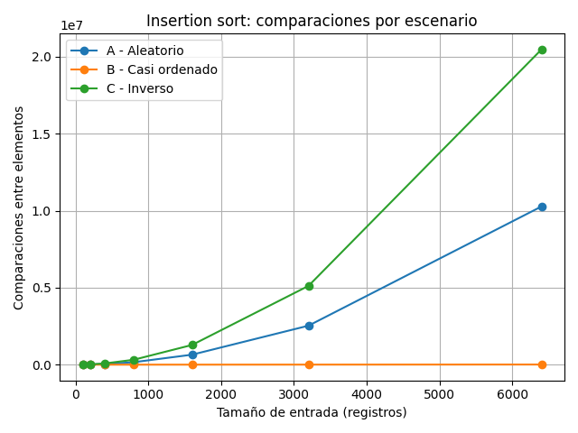
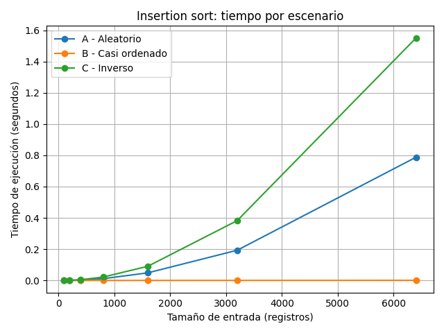
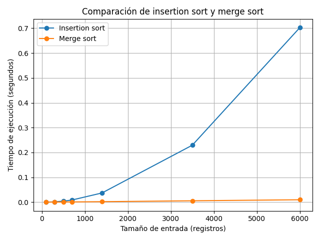

# Laboratorio 1 — Fundamentos, complejidad y recurrencias

## Datos del estudiante

Nombre: ALAN ARIAS RUIZ


# 1. Analizar el algoritmo antes de comprar hardware

En el caso de la plataforma Tamiza, es importante diferenciar entre corrección y eficiencia. 
Un algoritmo es correcto cuando produce el resultado esperado; en este caso, ordenar los registros según su índice de riesgo de mayor a menor. Sin embargo, que un algoritmo sea correcto no significa que sea adecuado para producción. También debe cumplir las restricciones de recursos y tiempo establecidas por el sistema.

Actualmente se utiliza insertion sort para ordenar aproximadamente 1.200.000 registros. El proceso debe ejecutarse durante la ventana nocturna de 2:00 a. m. a 6:00 a. m., por lo que existe una restricción máxima de cuatro horas. Aunque insertion sort puede producir correctamente el orden solicitado, su peor caso tiene complejidad Θ(n2). El crecimiento cuadrático hace que aumentar considerablemente el número de registros produzca un incremento mucho mayor en el tiempo de ejecución. Esto explica por qué un algoritmo que funcionaba cuando se procesaban alrededor de 20.000 registros puede dejar de ser viable al trabajar con más de un millón.

Duplicar la velocidad del servidor podría reducir aproximadamente el tiempo de ejecución por un factor cercano a dos bajo condiciones comparables, pero no modifica la complejidad del algoritmo. Un algoritmo Θ(n2) continúa siendo Θ(n2), por lo que el crecimiento de los datos seguirá generando el mismo problema. Por esta razón, antes de invertir solamente en hardware, es necesario analizar si existe un algoritmo con una complejidad más adecuada.

Un ejemplo adicional es utilizar insertion sort para ordenar varios millones de elementos cuando existe una ventana de procesamiento muy pequeña. El algoritmo puede producir una lista correctamente ordenada, pero si el número de elementos hace que el proceso tarde varias horas mientras el sistema solamente dispone de algunos minutos, la solución deja de ser viable aunque sea correcta.

Por tanto, el problema de Tamiza no se limita a la capacidad del servidor. El crecimiento de la entrada hace necesario considerar la complejidad del algoritmo utilizado.


# 2. Responsabilidad ambiental y ética

La elección del algoritmo también tiene consecuencias que van más allá del tiempo de ejecución.

Desde el punto de vista ambiental, un algoritmo que requiere mucho tiempo de CPU utiliza los recursos computacionales durante un periodo más prolongado. En Tamiza, el proceso se ejecuta diariamente durante la noche, por lo que una diferencia pequeña en una ejecución puede acumularse después de meses o años. Un algoritmo menos eficiente puede implicar un mayor uso de energía para realizar la misma tarea.

También existen consecuencias éticas relacionadas con las personas que dependen del resultado del proceso. Los registros ordenados determinan la prioridad con la que el centro de llamadas contactará a los pacientes. Si el proceso no termina dentro de la ventana disponible y deja registros sin ordenar o sin procesar, una persona que debería recibir atención prioritaria podría quedar fuera del listado utilizado por los operadores. El costo de este problema lo asumiría principalmente el paciente afectado, pero también el personal encargado de realizar el seguimiento.

Un segundo posible perjuicio ocurre para los operadores del centro de llamadas. Si reciben una lista incompleta o incorrectamente procesada, pueden trabajar con información que no representa correctamente la prioridad definida por el sistema. En este caso, el costo recae sobre los trabajadores, que deben afrontar las consecuencias de un procesamiento que terminó de forma incompleta.

Existe además una tensión entre eficiencia y responsabilidad. El ordenamiento no es solamente una operación técnica, porque el orden de la lista determina quién es contactado primero. Por esta razón, el sistema debe garantizar no solamente que los registros estén ordenados, sino que el proceso sea suficientemente confiable para cumplir la ventana de ejecución y producir una lista completa.

En consecuencia, la selección del algoritmo debe considerar tiempo de ejecución, consumo de recursos y las consecuencias que puede tener un procesamiento incompleto sobre las personas involucradas.


# 3. Peor caso, mejor caso y caso promedio

## Hipervinculos al código

* [Código de la Parte 3](./parte3_casos.py)
* [Implementación de los algoritmos](./algoritmos.py)
* [Generadores de datos](./datos.py)

## 3.1 Análisis de los casos

El mejor caso representa la situación en la que el algoritmo realiza la menor cantidad de trabajo posible para una entrada de tamaño determinado. En insertion sort ocurre cuando los elementos ya se encuentran ordenados según el criterio requerido. En este caso, el algoritmo realiza aproximadamente una comparación por posición y su complejidad es Θ(n).

El peor caso representa la entrada que provoca la mayor cantidad de trabajo. Para insertion sort ocurre cuando los elementos se encuentran en el orden contrario al requerido. En este escenario, cada elemento debe desplazarse a través de una parte importante de la lista, produciendo Θ(n²) comparaciones y movimientos.

El caso promedio representa el comportamiento esperado sobre entradas que no presentan una estructura especialmente favorable o desfavorable. Para insertion sort, el caso promedio también tiene complejidad Θ(n2).

En un sistema de producción con una ventana estricta de cuatro horas, el caso que debe utilizarse como criterio de seguridad es el peor caso, porque la plataforma no puede asumir que todas las entradas tendrán una estructura favorable. Una entrada inesperada puede provocar que el proceso supere la ventana disponible.

### Predicción previa

Antes de ejecutar el experimento se esperaba:

Aleatorio (A): Registros en orden aleatorio, este corresponderia al caso promedio Θ(n2).

Casi ordenado (B): 98 % ordenado y 2 % de registros nuevos al final, siendo cercano al mejor caso, aproximadamente Θ(n).

Inverso (C): Orden contrario al requerido, siendo el peor caso, Θ(n2)

## 3.2 Resultados experimentales

Los tamaños utilizados en el experimento fueron:

100, 300, 500, 700, 1400, 3500, 6000


### Escenario A — Aleatorio

|    n | Tiempo (s) | Comparaciones |
| ---: | ---------: | ------------: |
|  100 |   0.000155 |         2,542 |
|  300 |   0.001375 |             — |
|  500 |   0.004126 |             — |
|  700 |   0.008587 |             — |
| 1400 |   0.037048 |             — |
| 3500 |   0.229236 |             — |
| 6000 |   0.702409 |             — |

> Los tiempos anteriores corresponden a las mediciones experimentales realizadas para la comparación de la Parte 4. Las comparaciones de la Parte 3 deben mantenerse con la salida correspondiente a `parte3_casos.py`.

### Gráfica de comparaciones



### Gráfica de tiempo



Los resultados de las comparaciones muestran el comportamiento esperado. El escenario C presenta el mayor número de comparaciones y sigue exactamente el crecimiento cuadrático esperado. Para n = 6000 se obtienen:

$$
\frac{6000(5999)}{2}=17.997.000
$$

comparaciones en el peor caso.

El escenario B presenta un crecimiento mucho menor porque la mayor parte de los datos ya se encuentran en el orden requerido. Por esta razón, se comporta de manera cercana al mejor caso.

El escenario A presenta un comportamiento intermedio y representa el caso promedio. La comparación entre los tres escenarios confirma que el orden inicial de los datos tiene un impacto importante sobre insertion sort.

Los tiempos también muestran el crecimiento cuadrático en los escenarios desfavorables. Al aumentar el tamaño de entrada, duplicar aproximadamente la cantidad de elementos puede producir un aumento cercano a cuatro veces en el tiempo. Esto es consistente con una complejidad Θ(n2).


# 4. Complejidad de merge sort e insertion sort

## Código

* [Código de la Parte 4](./parte4_complejidad.py)
* [Implementación de los algoritmos](./algoritmos.py)
* [Generadores de datos](./datos.py)

## 4.1 Análisis teórico

### Merge sort

Merge sort divide la entrada en dos mitades, ordena recursivamente cada mitad y posteriormente combina las dos listas ordenadas.

La recurrencia es:

$$
T(n)=2T(n/2)+\Theta(n)
$$

El término:

$$
2T(n/2)
$$

representa las dos llamadas recursivas, cada una trabajando con aproximadamente la mitad de los elementos.

El término:

$$
\Theta(n)
$$

representa el trabajo realizado durante la combinación de las dos mitades, ya que cada elemento debe ser considerado durante el proceso de mezcla.

Aplicando el Teorema Maestro:

$$
a=2,\qquad b=2,\qquad f(n)=\Theta(n)
$$

y:

$$
n^{\log_b a}=n^{\log_2 2}=n
$$

Como:

$$
f(n)=\Theta(n^{\log_b a})
$$

se obtiene el caso 2 del Teorema Maestro:

$$
\boxed{T(n)=\Theta(n\log n)}
$$

Por tanto, merge sort mantiene un crecimiento Θ(n log n) en sus casos mejor, promedio y peor.

### Insertion sort línea por línea

En insertion sort, el ciclo principal comienza desde el segundo elemento y recorre la lista.

En el mejor caso, la condición de orden se cumple inmediatamente para cada elemento. Por ello se realiza aproximadamente una comparación por posición:

$$
1+1+\cdots+1=n-1
$$

por lo que:

$$
T(n)=\Theta(n)
$$

En el peor caso, cada nuevo elemento debe compararse con todos los elementos anteriores:

$$
1+2+3+\cdots+(n-1)
$$

Esta suma es:

$$
\frac{n(n-1)}{2}
$$

por lo tanto:

$$
T(n)=\Theta(n^2)
$$

El caso promedio también presenta crecimiento cuadrático:

$$
T(n)=\Theta(n^2)
$$

### Tabla de complejidades

| Algoritmo      | Mejor caso | Caso promedio | Peor caso  |
| -------------- | ---------- | ------------- | ---------- |
| Insertion sort | Θ(n)       | Θ(n²)         | Θ(n²)      |
| Merge sort     | Θ(n log n) | Θ(n log n)    | Θ(n log n) |


# 4.2 Validación experimental

Se compararon insertion sort y merge sort utilizando entradas aleatorias y los mismos tamaños:

100, 300, 500, 700, 1400, 3500, 6000


Los resultados obtenidos fueron:

|    n | Insertion sort (s) | Merge sort (s) |
| ---: | -----------------: | -------------: |
|  100 |           0.000199 |       0.000121 |
|  300 |           0.001375 |       0.000359 |
|  500 |           0.004126 |       0.000615 |
|  700 |           0.008587 |       0.000913 |
| 1400 |           0.037048 |       0.001985 |
| 3500 |           0.229236 |       0.005606 |
| 6000 |           0.702409 |       0.009727 |

### Gráfica comparativa



Los resultados muestran una diferencia creciente entre ambos algoritmos a medida que aumenta el tamaño de la entrada. Para tamaños pequeños la diferencia puede ser reducida, pero al incrementar el número de registros insertion sort aumenta su tiempo mucho más rápidamente.

El comportamiento experimental coincide con el análisis teórico: insertion sort presenta un crecimiento cuadrático para entradas aleatorias, mientras que merge sort presenta un crecimiento Θ(n log n).

Para 6000 registros, insertion sort tardó 0.702409 segundos frente a 0.009727 segundos de merge sort en esta medición. Estos valores dependen del equipo utilizado y no deben interpretarse como tiempos universales.

---

# 4.3 Concepto técnico para la Secretaría de Salud

El problema de Tamiza requiere considerar tanto la complejidad teórica como los resultados experimentales. La plataforma debe ordenar aproximadamente 1.200.000 registros durante una ventana máxima de cuatro horas. Además, los datos pueden llegar desde diferentes canales y su estructura puede cambiar entre una ejecución y otra. Por esta razón, no resulta suficiente diseñar el sistema suponiendo que siempre recibirá una entrada casi ordenada.

Los experimentos muestran que insertion sort puede comportarse adecuadamente cuando la entrada está casi ordenada, pero su comportamiento empeora considerablemente cuando aumenta el tamaño o cuando los registros presentan un orden desfavorable. En las mediciones realizadas, para 6000 registros insertion sort tardó 0.702409 segundos, mientras que merge sort tardó 0.009727 segundos. Esta diferencia experimental aumenta con el tamaño de entrada.

Para estimar el comportamiento con 1.200.000 registros se utilizó una extrapolación desde la medición de 6000 registros. Para insertion sort se utilizó un crecimiento cuadrático y para merge sort un crecimiento proporcional a n log n. La estimación obtenida fue de aproximadamente 28.096,34 segundos, equivalentes a 7,80 horas, para insertion sort, mientras que para merge sort fue de aproximadamente 3,13 segundos. Estas cifras son estimaciones matemáticas y no mediciones directas con 1.200.000 registros.

La propuesta de simplemente duplicar la velocidad del servidor no cambia la complejidad Θ(n2) de insertion sort. Incluso suponiendo una reducción aproximada a la mitad del tiempo, la estimación cuadrática continuaría estando alrededor de varias horas y no resolvería de manera estructural el crecimiento del algoritmo.

Por estas razones, la implementación propuesta utiliza merge sort, cuya complejidad es Θ(n log n) en los casos mejor, promedio y peor. Esto proporciona un comportamiento más estable cuando cambia la distribución de los datos.

También deben considerarse otros aspectos. Merge sort utiliza memoria adicional para realizar las divisiones y mezclas, por lo que el consumo de memoria debe evaluarse junto con el rendimiento. Además, la implementación debe mantenerse clara y documentada para reducir errores futuros. Finalmente, si el escenario B cambia con el tiempo y deja de estar casi ordenado, el beneficio que insertion sort obtiene de esa estructura podría desaparecer, mientras que merge sort mantiene su complejidad asintótica.

En conclusión, el cambio de algoritmo aborda directamente el problema de escalabilidad identificado en el sistema, mientras que la mejora de hardware puede considerarse una medida complementaria y no un reemplazo del análisis de complejidad.


# 5. Reproducción del experimento

## Requisitos

Instalar las dependencias del proyecto mediante:

pip install -r requirements.txt


Activar el entorno virtual:

.\venv\Scripts\Activate.ps1


## Ejecutar la Parte 3

python .\parte3_casos.py


Este programa genera:

graficas/parte3_comparaciones.png
graficas/parte3_tiempo.png


## Ejecutar la Parte 4


python .\parte4_complejidad.py


Este programa genera:


graficas/parte4_tiempo.png


Las mediciones utilizan `time.perf_counter()` y los algoritmos implementados manualmente. No se utilizan `sorted()` ni `list.sort()` para realizar el ordenamiento.


# 6. Estructura del laboratorio

La estructura final nos deberia quedar algo asi:
```
lab1-fundamentos-complejidad-recurrencias/
├── README.md
├── algoritmos.py
├── datos.py
├── parte3_casos.py
├── parte4_complejidad.py
└── graficas/
    ├── parte3_comparaciones.png
    ├── parte3_tiempo.png
    └── parte4_tiempo.png
```

